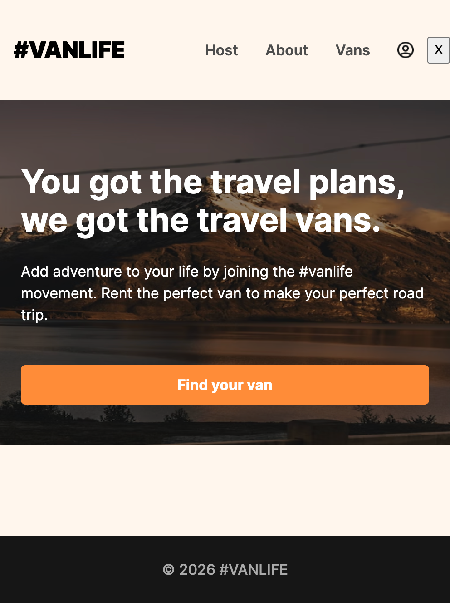
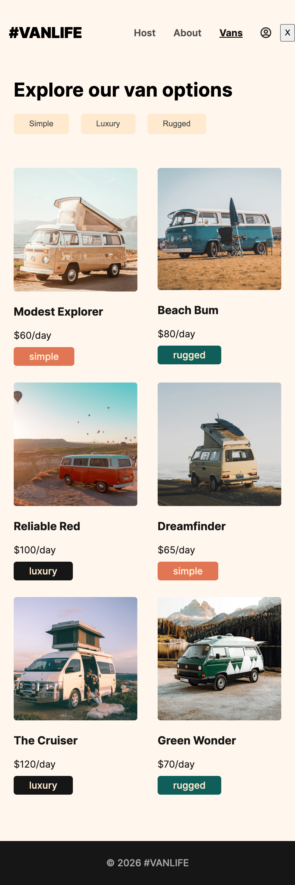
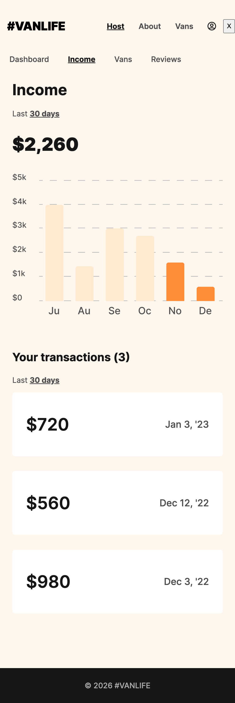

## Vanlife
A modern van rental web application built with **React**, featuring advanced routing, **authentication**, and **cloud database** integration.

This project focuses on real-world routing, **Firebase integration**, modern React patterns and data loading patterns using **React Router loaders** instead of traditional `useEffect`.

This project was created to practice Firebase Firestore integration, state management, and component architecture in React.

[ Let's Try in Live :)](https://gmarav05.github.io/vanlife/)

## 🔐 Authentication

**Test Credentials:**
- Email: `a@a.com`
- Password: `123`


**Note:** This is a demonstration project with simplified authentication. Do not use this authentication pattern in production.

### Video Demo

<div align="center">
  <video width="600" controls>
    <source src="./demo.mp4" type="video/mp4">
    Your browser does not support the video tag.
  </video>
</div>


## Image

<div align="center">
  
  <p><i>Home Page</i></p>
</div>

<div align="center">
  
  <p><i>Van Listings with Filters</i></p>
</div>

<div align="center">
  
  <p><i>Host Dashboard</i></p>
</div>

## 🚀 Features

### 🌍 Public Features
- **Home Page**: Welcoming landing page with call-to-action.

- **About Page**: Information about the VanLife service.

- **Van Listings**: Browse all available vans with filtering options.

  - Filter by type: **Simple**, **Luxury**, **Rugged**.

  - Detailed van information pages.

- **Responsive Design**: Mobile-friendly interface.

#

### 🧑‍💼 Host Features (Protected Routes)

- **Dashboard**: Overview of income, reviews, and listed vans.

- **Income Tracking**: View earnings and transaction history.

- **Van Management**: List and manage your vans.

- **Reviews**: View customer reviews and ratings.

- **Detailed Van Pages**: 
  - Van information.
  - Pricing details.
  - Photo gallery.

### ⚙️ Under the Hood

- **User Authentication**: Secure login system with **protected routes**.

- **Protected Routes**: Route-level auth using **React Router loaders**.

- **Advanced Routing**: Nested & layout routes with React Router v6.

- **Real-time Database**: Firebase Firestore integration for data persistence.

- **Mock API**: Development mode with **MirageJS** for rapid prototyping.

- **Clean UI**: Modern, minimalist interface with intuitive navigation.

- **Data Loading**: Efficient data fetching using React Router loaders instead of `useEffect`.

- **Performance**: Optimized rendering with React best practices.

- **Built with Modern Tools**: Built using **React 19** and **Vite** for fast development and builds.


## Authentication
- Route-level authentication using **React Router loaders**.

- User login system with route protection.

- Redirect to login for unauthorized access.

- Preserves intended destination after login.

## Learnings

- Built nested and dynamic routes with shared layouts using **```Outlet```**.

- Gained hands-on experience with **React Router v6 Data APIs**, including **```loaders```**,**```defer```**, and **```Await```** for data fetching.

- Learned to replace traditional **```useEffect-based```** API calls with route-level data loading for cleaner and more predictable component logic.

- Implemented **```route-based```** authentication using **```loaders```**, protecting entire route trees instead of individual components.

- Integrated **Firebase Firestore** for real-time data storage and retrieval.

- Understood how to handle redirects and error boundaries correctly in **React Router**.

- Improved understanding of asynchronous JavaScript, promises, and loading states with **```Suspense```**.

- Practiced separation of concerns by keeping data logic in loaders and UI logic in components.

- Used **Mirage JS** to mock backend APIs and simulate real-world server behavior during development.

- Practiced Fetching and handling data from **Firebase Firestore**.

- Practiced Async Operations and Handling asynchronous data fetching and loading states.

- Solved real-world issues related to static asset handling and base paths when deploying with Vite.

- Strengthened overall **React component architecture**, file organization, and scalability practices.

- Responsive Design: Creating mobile-first, adaptive layouts.


## Live demo

[ View Live  :)](https://gmarav05.github.io/vanlife/)


## Technology Stack


- **React 19** – UI library

- **React Router DOM 6** – Routing with data loaders

- **Vite 7.2** – Build tool and dev server

- **Firebase 12.7** – Backend and database (Firestore)

- **MirageJS 0.1** – Mock API server for development

- **React Icons 5** – Icon components

- **CSS3** – Styling

- **GitHub Pages** – Deployment


## Project Structure
```
vanlife/
├── src/
│   ├── assets/
│   │   └── images/          # Image assets
│   ├── components/
│   │   ├── Error.jsx        # Error boundary component
│   │   ├── Footer.jsx       # Footer component
│   │   ├── Header.jsx       # Navigation header
│   │   ├── HostLayout.jsx   # Host section layout
│   │   └── Layout.jsx       # Main layout wrapper
│   ├── pages/
│   │   ├── Host/
│   │   │   ├── Dashboard.jsx
│   │   │   ├── HostVans.jsx
│   │   │   ├── HostVanDetail.jsx
│   │   │   ├── HostVanInfo.jsx
│   │   │   ├── HostVanPhotos.jsx
│   │   │   ├── HostVanPricing.jsx
│   │   │   ├── Income.jsx
│   │   │   └── Reviews.jsx
│   │   ├── Vans/
│   │   │   ├── Vans.jsx
│   │   │   └── VanDetail.jsx
│   │   ├── About.jsx
│   │   ├── Home.jsx
│   │   ├── Login.jsx
│   │   └── NotFound.jsx
│   ├── api.js               # Firebase API functions
│   ├── index.css            # Global styles
│   ├── index.jsx            # App entry point
│   ├── server.js            # MirageJS mock server
│   └── utils.js             # Utility functions
├── package.json
└── vite.config.js
```

## 🚀 Getting Started

### Installation

- Node.js (v16 or higher)
- npm or yarn
- Firebase account (for production use)


1. Clone the repository:

   ```bash
   git clone https://github.com/gmarav05/vanlife.git
   cd vanlife
   ```


2. Install dependencies:

```sh
npm install
```


3. Configure Firebase:
   - Update the Firebase configuration in `api.js` with your own credentials.
   - Set up Firestore database with a `vans` collection.


4. Start the development server:

```sh
npm run dev
```

5. Open your browser and navigate to `http://localhost:5173`

## Project Structure
```
vanlife/
├── src/
│   ├── assets/
│   │   └── images/          # Image assets
│   ├── components/
│   │   ├── Error.jsx        # Error boundary component
│   │   ├── Footer.jsx       # Footer component
│   │   ├── Header.jsx       # Navigation header
│   │   ├── HostLayout.jsx   # Host section layout
│   │   └── Layout.jsx       # Main layout wrapper
│   ├── pages/
│   │   ├── Host/
│   │   │   ├── Dashboard.jsx
│   │   │   ├── HostVans.jsx
│   │   │   ├── HostVanDetail.jsx
│   │   │   ├── HostVanInfo.jsx
│   │   │   ├── HostVanPhotos.jsx
│   │   │   ├── HostVanPricing.jsx
│   │   │   ├── Income.jsx
│   │   │   └── Reviews.jsx
│   │   ├── Vans/
│   │   │   ├── Vans.jsx
│   │   │   └── VanDetail.jsx
│   │   ├── About.jsx
│   │   ├── Home.jsx
│   │   ├── Login.jsx
│   │   └── NotFound.jsx
│   ├── api.js               # Firebase API functions
│   ├── index.css            # Global styles
│   ├── index.jsx            # App entry point
│   ├── server.js            # MirageJS mock server
│   └── utils.js             # Utility functions
├── package.json
└── vite.config.js
```


### Build for production

```sh
npm run build
```

### Deploy to GitHub Pages

```sh
npm run deploy
```


## 🔑 Key Concepts & Patterns

### React Router Loaders
This project uses React Router's data loading pattern instead of `useEffect` for data fetching:

```javascript
// Example loader function
export async function loader({ params }) {
    return getVan(params.id)
}

// Usage in component
const van = useLoaderData()
```

**Benefits:**
- Data loads before component renders.
- Better error handling.
- Improved user experience with loading states.
- Cleaner component code.

### Protected Routes
Authentication is handled using route loaders:

```javascript
export async function requireAuth(request) {
    const isLoggedIn = localStorage.getItem("loggedin")
    if (!isLoggedIn) {
        throw redirect(`/login?message=You must log in first`)
    }
}
```


### Firebase Integration
Firestore Lite is used for optimized data fetching:

```javascript
export async function getVans() {
    const querySnapshot = await getDocs(vansCollectionRef)
    return querySnapshot.docs.map(doc => ({
        ...doc.data(),
        id: doc.id
    }))
}
```


### Deferred Data Loading
Uses React Router's `defer` for improved loading states:

```javascript
export function loader() {
    return defer({ vans: getVans() })
}

// In component
<React.Suspense fallback={<h2>Loading...</h2>}>
    <Await resolve={dataPromise.vans}>
        {renderVanElements}
    </Await>
</React.Suspense>
```


## 🔐 Authentication

**Test Credentials:**
- Email: `a@a.com`
- Password: `123`


**Note:** This is a demonstration project with simplified authentication. Do not use this authentication pattern in production.

## 📦 Available Scripts

- `npm run dev` - Start development server.
- `npm run build` - Build for production.
- `npm run preview` - Preview production build.
- `npm run lint` - Run ESLint.
- `npm run deploy` - Deploy to GitHub Pages.


## 🚀 Deployment

The project is configured for GitHub Pages deployment:

1. Update the `homepage` field in `package.json`.
2. Run `npm run deploy`.


## 🗄️ Database Schema

### Vans Collection
```javascript
{
    id: string,
    name: string,
    price: number,
    description: string,
    imageUrl: string,
    type: "simple" | "luxury" | "rugged",
    hostId: string
}
```

**Note:** This is a portfolio/learning project. While functional, it should not be used as-is for production applications without implementing proper security measures, particularly around authentication and payment processing.

---


 